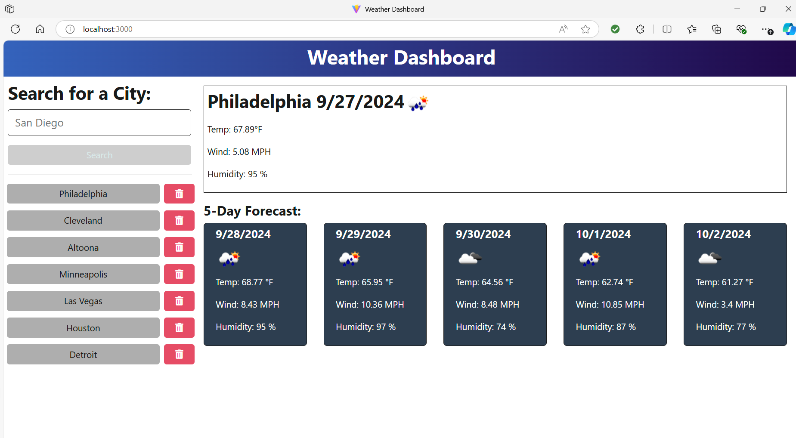

# weather_dashboard

## Description
This readme is used to explain how to search for cities and display their weather information.

## Table of Contents
- ###[Description](#description)
- ###[Installation](#installation)
- ###[Usage](#usage)
- ###[License](#license)
- ###[Contributors](#contributors)
- ###[Screenshot](#screenshot)
- ###[Questions](#questions)

## Installation
To install the weather application, you will need to first open the terminal and type "npm insatall" to install the node module. Then type "npm run client:dev" to run the server hosting the site.

## Usage
This project is used to search different cities and view the weather for the current day and the next 5 days after. 

## License
This project is licensed under the MIT license.

## Contributors
Jermaine Strand

## Screenshot
Below is a screnshot of the Weather Dashboard site.

## Questions
For any questions, please contact me at: jermaine.strand@yahoo.com.
Github Profile: https://github.com/jaystrand/weather_dashboard.